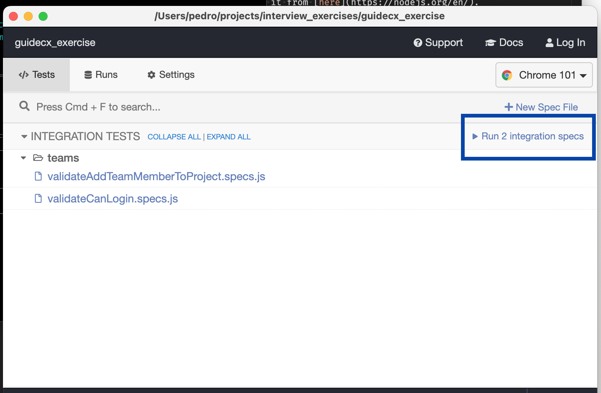
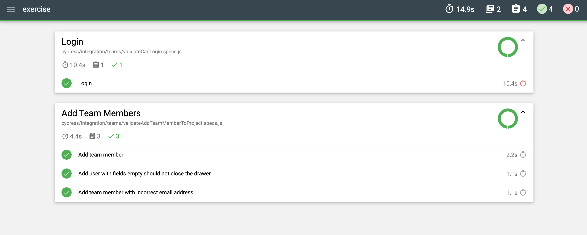
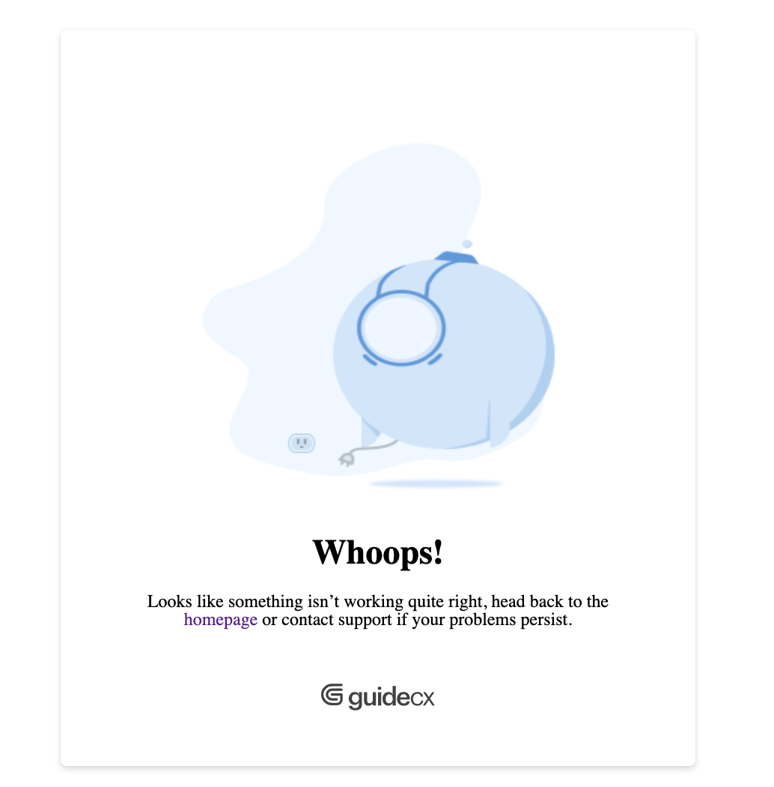

# Coding Exercise
The content of this project is the implementation of some tests using the [Cypress](https://www.cypress.io/) testing framework.

## To run the tests
There is a lengthy explanation in the rest of the document but in case you want to get to the fun part I added this section first.

Export the two environment variables with the respective values sent to you via email.
```
export CYPRESS_GCX_EMAIL=
export CYPRESS_GCX_PASSWORD=
```

I did it this way to avoid checking in credentials in GitHub.

If you're on a Mac chances are you have `node` and `npm` installed, if not you can download it and install it from [here](https://nodejs.org/en/).

Clone the project from GitHub

Once the project is on your machine `cd` into the directory and run:
```
npm install
```

### Run the tests with `npm` and headed `Chrome`
```
npm run tests
```
This command will run the tests using ther version of chrome is installed on your machine.


### Run the tests with `npm` and headless `chrome`
```
npm run tests_chrome_headless
```
This command will run the tests from your machine using `chrome`

### Other options
To see what other options are there to run the tests type
```
npm run
```

### Run the tests in the Cypress interactive UI
The tests pass more consistently if they're ran from the Cypress UI

```
npm run open
```

To run all the tests click on "Run 2 integration tests" indicated in the image below.

To run either one of the tests click on the test name shown in the image.



### To run the tests in a Docker container
Assuming you have `docker` on your machine and have set the two environment variables mentioned above you can run the tests in Docker as follows:

(I realize this is not the same as Dockerizing the tests)

```
docker run --env CYPRESS_GCX_EMAIL=${CYPRESS_GCX_EMAIL} --env CYPRESS_GCX_PASSWORD=${CYPRESS_GCX_PASSWORD} -it -v $PWD:/e2e -w /e2e cypress/included:9.6.1
```

Since the command is mounting your current working directory as a volume all the tests are loaded into the image and all the output files are written into your directory.

## Tests reports
When the tests run a report is generated in the directory `cypress\report` which you can open with a browser.



The following directories also get created:

`cypress/screenshots` - Screenshots of any failed tests

`cypress/videos` - Videos of the tests as they run whether they test pass or fail.

# About The Tests
I used the tests to demonstrate the capabilities of Cypress.

This project tries to separate the data needed to run the tests, including the definitions of the elements for the selector operations, from the tests and from "page" objects that use those elements.

I write "page" object above in quotes because the type of page object model (POM) used in this project is not the usual POM method where data and functions to drive the web page live together in a class. In this exercise data is separate from the functions that drive the tests so as to:
- Avoid keeping state within the page object.
- Make it more flexible to feed different data to the same page object.

All that while maintaining a distinction between tests, code to access a given page, and data used by the tests.

## validateCanLogin.specs
This test uses the basic capabilities of Cypress. 

The `beforeEach` hook uses commands and data elements and functions that live in a separate file.

This test is to make the viewer of this document familiar with the capabilities of Cypress.

## validateAddTeamMemberToProject.specs
The first test `'Add team member'` demonstrates more use of the page files and attempt to fill the requirements for the exercise of:
- Add Team Member to project
  - Click on Project
  - Click the Team tab
  - Click + Add Team Member
  - Fill out and submit the form

The other two test cases address the edge cases I allowed myself to write w/o spending more time on the exercise and address the other requirement of:

- Automate any relevant edge cases you think might be necessary

`'Add user with fields empty should not close the drawer'` Doesn't fill the form and assert that the form remains after clicking on the button to submit.

`'Add team member with incorrect email address'` Fails on what I think is a behavior that should not be allowed which is to create an email without a full domain after the `@`.  I've seen it a couple of times where there is a conflict between the `getter` of the element and the assertion and this test will give us a false positive result.

## Observations
- As I was writing tests the code kept adding team members to the project and it became a bit overwhelming to look for the most recent tests elements.  I looked for a way, but could not find one, to delete the team members.  Being able to delete team members would be a nice feature to have for people who might submit coding exercises in the future. If the feature already exists then apologies.
- Setting the focus on the email address field in the [Auth page](https://app.staging.guidecx.io/auth/login) would be nice.
- Resetting password didn't work more than once.
- I think there should be an eye (<o>) to view the password in plain text.
- On the other hand I noticed that while typing the password the value is reflected in the DOM if one has the elements view open in the browser.
- Resend invite.  As I was becoming familiar with the app I typed in a password that I could not remember.  I tried resetting the password but that didn't work for me.  I tried resending the invite at least 3 times, eventually one of the links in the email from the resend invite function took me to page that displayed the image below.  Fortunately I was able to remember the password.

- There are a few `delay(...)` statements which I don't like especially since Cypress allows you to do "smart" waits.  See function `addTeamMember` but I wanted to submit this exercise.  You can try to change the timeout in the cypress.json file if you want.  Look for "defaultCommandTimeout": 30000
- I tried to use data tests IDs only for the selectors. There is one case in the selectors where we use a class definition. For example see file `cypress/data/projects_data.js`
- On my old machine the video compression takes a while.  Hopefully it is not so slow on your machine.

